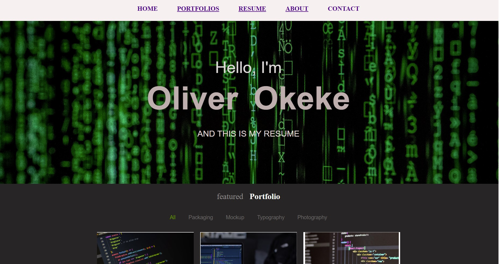

#My Portfolio Website

This is my personal portfolio website designed to showcase my projects, skills, and experiences as a Software Engineering student. 
Built with modern web development technologies, the site provides an interactive and visually appealing way to explore my work.
**Live Demo:** [My Portfolio Link](my domain link)

##features

- Responsive design for seamless experience across devices
- Showcases multiple projects (currently as wordings)
- About Me section highlighting my personal qualities and skills
- Integrated contact form to reach out easily
- Smooth navigation across different sections of the website

##Tech Stack
- **Frontend**: HTML5, CSS3
- **Styling**: CSS3
- **Deployment**: [GitHub Pages](https://pages.github.com/)

## Screenshots

